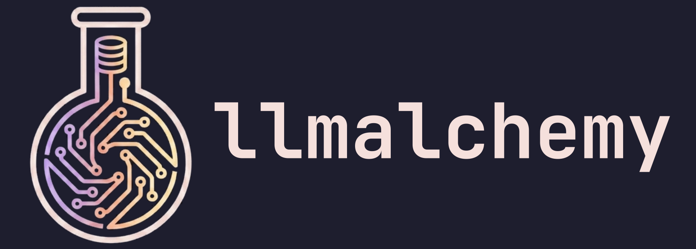
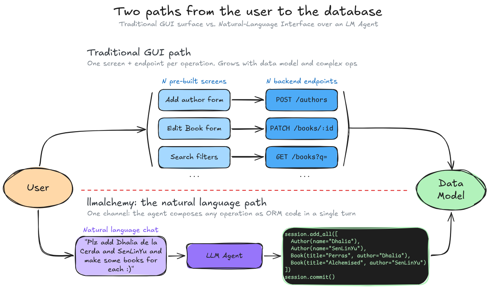
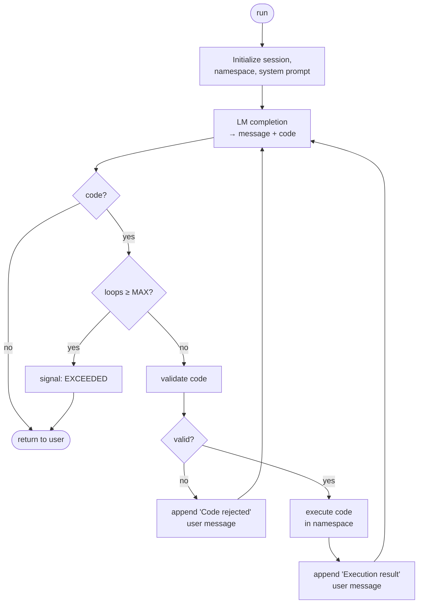

Every **new operation** you want to allow a user to perform on your application's data model means **new logic** (backend) and a **new screen** (frontend). Then, the user has to learn how to perform that particular operation.

`llmalchemy` removes that layer. Hand an LM your ORM schema and a sandboxed Python environment. **The user requests any operation through natural language**. The agent composes its own queries and transformations as code in a single turn.

**You do not need to define a thousand GUIs for each possible action, nor a thousand tools for the LM to leverage** (GET X, POST Y, etc.): the abstraction to freely manipulate the data model already exists: it is SQL. ORM and python add an infinite number of possibilities on top.



**Read the complete motivation / reasoning in the [whitepaper](#whitepaper-why-llmalchemy)**

## Installation

`uv add llmalchemy`, or use your favorite package manager

## Usage

The only thing you need to define upfront is your database schema through an sqlalchemy declarative base:
```python
from llmalchemy.agent import State, run
from lmdk import UserMessage
from sqlalchemy.orm import DeclarativeBase, Mapped, mapped_column

class Base(DeclarativeBase): ...

class Author(Base):
    """An author who can write many books."""

    __tablename__ = "authors"

    id: Mapped[int] = mapped_column(primary_key=True, autoincrement=True)
    name: Mapped[str] = mapped_column(String(120))

    books: Mapped[list["Book"]] = relationship(back_populates="author")


class Book(Base):
    """A book belonging to a single author."""

    __tablename__ = "books"

    id: Mapped[int] = mapped_column(primary_key=True, autoincrement=True)
    title: Mapped[str] = mapped_column(String(200))
    author_id: Mapped[int] = mapped_column(ForeignKey("authors.id"))

    author: Mapped["Author"] = relationship(back_populates="books")


model = "vertex:gemini-3-flash-preview"
```

For the minimal run, append the first message to the conversation and simply iterate over the `run` call.
You will recieve `Events` with the messages and code results performed by the agent, together with precise signals indicating the agents loop state (waiting for the LM completion, executing code, etc.):

```python
state = State()
state.messages.append(UserMessage("Add authors Tolkien and Dhalia de la Cerda, and two books for each."))

for event in run(state=state, base=Base, model=model):
    print(event)
```

Example output (abbreviated):
```text
SystemInstructionEvent(content='You are a coding agent... SCHEMA: class Author...')
SignalEvent(signal=<Signal.COMPLETION: 'COMPLETION'>)
MessageEvent(message=AssistantMessage(message="I'll add the authors and their books.", code="a1 = Author(name='J.R.R. Tolkien')\na2 = Author(name='Dhalia de la Cerda')\nsession.add_all([a1, a2])\nsession.flush()\nsession.add_all([\n    Book(title='The Hobbit', author_id=a1.id),\n    Book(title='The Lord of the Rings', author_id=a1.id),\n    Book(title='Desde los zulos', author_id=a2.id),\n    Book(title='Perras de reserva', author_id=a2.id),\n])\nsession.commit()\nprint('ok')"))
SignalEvent(signal=<Signal.VALIDATION: 'VALIDATION'>)
SignalEvent(signal=<Signal.EXECUTION: 'EXECUTION'>)
MessageEvent(message=UserMessage(content='Execution result:\nok\n'))
SignalEvent(signal=<Signal.COMPLETION: 'COMPLETION'>)
MessageEvent(message=AssistantMessage(message='Done — added Tolkien and Dhalia de la Cerda with two books each.', code=''))
```

The `state` presists across calls, just append a new UserMessage and call run() again to continue the conversation.

<details>
<summary>Custom tools</summary>
You can define any pre-built function that you want the agent to have access to.
These can modify the database or do something completely different, like performing math operations or calling another API.

```python
from sqlalchemy.orm import Session
from llmalchemy.tools import tool

@tool
def get_author_catalog(author: str, session: Session) -> list[str]:
    """List all book titles for the given author."""
    obj = session.query(Author).filter(Author.name == author).first()
    return [b.title for b in obj.books] if obj else []

state.messages.append(UserMessage("whats the catalog for Dhalia de la Cerda?"))
for event in run(state=state, base=Base, model=model, tools=[get_author_catalog]):
    print(event)
```

Example output (abbreviated):
```text
SignalEvent(signal=<Signal.COMPLETION: 'COMPLETION'>)
MessageEvent(message=AssistantMessage(message='Let me check the tool signature first.', code="disclose('get_author_catalog')"))
SignalEvent(signal=<Signal.EXECUTION: 'EXECUTION'>)
MessageEvent(message=UserMessage(content="Execution result:\nget_author_catalog(author: str, session: Session) -> list[str]\nList all book titles for the given author.\n"))
SignalEvent(signal=<Signal.COMPLETION: 'COMPLETION'>)
MessageEvent(message=AssistantMessage(message='', code="print(get_author_catalog('Dhalia de la Cerda', session))"))
SignalEvent(signal=<Signal.EXECUTION: 'EXECUTION'>)
MessageEvent(message=UserMessage(content="Execution result:\n['Desde los zulos', 'Perras de reserva']\n"))
SignalEvent(signal=<Signal.COMPLETION: 'COMPLETION'>)
MessageEvent(message=AssistantMessage(message="Dhalia de la Cerda's catalog: 'Desde los zulos' and 'Perras de reserva'.", code=''))
```

Only the tool name and first docstring line are shown to the agent up-front.
The agent calls `disclose("get_author_catalog")` to inspect the full signature on demand.
</details>

<details>
<summary>Allowed imports</summary>
For safety, no imports are allowed inside agent-generated code.
Whitelist any stdlib or third-party module the agent may need.

```python
state.messages.append(UserMessage("what day is today?"))
for event in run( state=state, base=Base, model=model, allowed_imports=["datetime"]):
    print(event)
```

Example output (abbreviated):
```text
SignalEvent(signal=<Signal.COMPLETION: 'COMPLETION'>)
MessageEvent(message=AssistantMessage(message='', code='import datetime\nprint(datetime.date.today().isoformat())'))
SignalEvent(signal=<Signal.VALIDATION: 'VALIDATION'>)
SignalEvent(signal=<Signal.EXECUTION: 'EXECUTION'>)
MessageEvent(message=UserMessage(content='Execution result:\n2026-04-21\n'))
SignalEvent(signal=<Signal.COMPLETION: 'COMPLETION'>)
MessageEvent(message=AssistantMessage(message='Today is 2026-04-21.', code=''))
```

If the agent tries to import something not whitelisted, validation fails and it gets a second chance:
```text
MessageEvent(message=UserMessage(content="Code rejected: import of 'os' is not allowed"))
```
</details>

<details>
<summary>Custom system prompt</summary>
You can pass a Jinja template to override the default one (see `src/llmalchemy/prompt.jinja`).
It is recommended that the template contains vars {{ SCHEMA }}, {{ SYMBOLS }} and {{ TOOLS }}.

```python
prompt = """Write python code to answer user requests. You have access to {{ SCHEMA }}, {{ SYMBOLS }} and {{ TOOLS }}"""
for event in run(
    state=state,
    base=Base,
    model=model,
    prompt_template="path/to/prompt.jinja",
):
    print(event)
```

The emitted events are the same as in the minimal example; only the `SystemInstructionEvent` content changes to reflect your custom template:
```text
SystemInstructionEvent(content='Write python code to answer user requests. You have access to <schema...>, <symbols...> and <tools...>')
```
</details>

<details>
<summary>Output extensions</summary>
By default, the agent responds with a `message` for the user and optional `code` to perform actions.
You can specify any additional fields for the LM to fill.

```python
from pydantic import BaseModel, Field

class Reasoning(BaseModel):
    thoughts: str = Field(description="Scratchpad before answering.")
    confidence: float = Field(description="0..1 confidence score.")

for event in run(
    state=state,
    base=Base,
    model=model,
    output_extensions=Reasoning,
):
    print(event)
# Extra fields ride along on the yielded AssistantMessage for you to consume:
#
# MessageEvent(message=AssistantMessage(
#     thoughts='The user asked X; I should query Y then aggregate by Z.',
#     confidence=0.82,
#     message='Here are the results ...',
#     code='...',
# ))
```
</details>

## How it works
In short: **user input → LM generates SQLAlchemy code → validate → execute → return results to LM → repeat until done**



1. **Schema as context** (`context.py`): The source code of your ORM classes is extracted via `inspect.getsource` and rendered into a Jinja system prompt alongside available symbols and tools.

2. **Agentic loop** (`agent.py`): The LM produces structured output — a message and optional Python code. If code is present, it's validated, executed, and the result is fed back as a user message. The loop continues until the LM responds without code or hits `MAX_LOOPS`.

3. **Sandboxed execution** (`code.py`): An AST pass blocks dangerous builtins (`exec`, `eval`, `open`…), forbidden modules (`os`, `subprocess`…), dangerous dunder access, and enforces an import whitelist. Safe code runs in a persistent namespace with stdout captured.

4. **Optional tools** (`tools.py`): Developers can register custom functions with the `@tool` decorator. Only tool names and one-liners appear in the prompt — the LM calls `disclose(name)` to see full signatures on demand, keeping the context window lean.

## Whitepaper (why `llmalchemy`)

### Tool calling hits a wall

The standard agentic pattern is function calling: define tools, let the LM pick one, read the result, repeat. This is clean and safe, but it doesn't scale.

Real applications have complex data models. To give the LM meaningful access you end up writing dozens of tools, each one crowding the context window. Every compound operation (filter, then aggregate, then compare) either needs its own dedicated tool or forces the agent to chain calls across multiple LM completions — slow and expensive. And you become the bottleneck: every new user need is a new tool to design, implement, test and document.

### Code as the action space

Research shows that letting LMs write and execute code instead of picking from a discrete set of tools produces stronger agents[[1](https://arxiv.org/abs/2402.01030)][[2](https://arxiv.org/pdf/2401.00812)][[3](https://arxiv.org/pdf/2411.01747)][[4](https://platform.claude.com/docs/en/agents-and-tools/tool-use/programmatic-tool-calling)][[5](https://blog.cloudflare.com/code-mode/)]. Code gives the model composition (chain operations in one turn), control flow (loops, conditionals, error handling), and self-extension (define helper functions that persist in the namespace). A single code block can do what would otherwise take a long chain of tool calls.

But code execution alone doesn't solve the data access problem. The LM still needs some interface to read and modify application state. You're back to writing wrapper functions — unless the right abstraction already exists.

### Relational algebra is the interface you don't have to build

And it does. Relational algebra is a solved discipline: decades of refinement behind optimal ways of organizing and querying structured data. SQL databases implement it. ORMs like SQLAlchemy wrap it in the same Python the LM is already writing.

By placing an ORM session and the model classes in the agent's execution namespace, `llmalchemy` gives the LM full, structured access to the data without a single hand-crafted tool. The developer defines the schema once — which they'd do anyway. The LM handles everything else.

### What this means for applications

Traditional software requires two layers of work on top of the data model:

1. **Business logic** (backend) — functions and endpoints for every operation users might need.
2. **UI workflows** (frontend) — screens, forms and click sequences to expose those operations.

Both layers grow with the complexity of the data model and the operations pipelines that we want to allow for the user.

With `llmalchemy`, the developer defines the schema and optionally a handful of tools for things that genuinely require custom logic (sending emails, calling external APIs, very complex workflows). Everything else — every query, every data transformation, every "find all X where Y and then update Z" — the LM composes on the fly.

For users, this replaces navigating menus and filling forms with describing what they want. It removes the mismatch between what the user is thinking and the rigid paths a GUI offers.

### Beyond file systems

Today's coding agents (Opencode, Pi, Claude Code) prove that LMs can navigate file structures effectively with tools as simple as `bash`, `read`, `write` and `edit`. But file systems are structurally simple: trees of named nodes with blob contents.

Application data is a different beast. Dozens of entity types, foreign keys, many-to-many relationships, constraints, cascading dependencies. Relational data is orders of magnitude richer than a directory tree. The ORM gives the LM the right abstraction: it thinks in terms of entities, relationships and queries rather than raw files.

## Development

### Structure
```
src/llmalchemy/
├── agent.py      # Entrypoint for the agentic loop
├── code.py       # Sandboxed python env on which to run the agent requested code
├── context.py    # Utils to engineer the context passed to the agent
├── datbase.py    # Utils that access or modify the database
├── prompt.jinja  # Default system instruction template
└── tools.py      # Logic to expose functions to the model
```

### Tooling
We use `just` for development tasks. Use:
- `just sync`: Updates lockfile and syncs environment.
- `just format`: Lints and formats with `ruff`.
- `just check-types`: Static analysis with `ty`.
- `just check-complexity`: Cyclomatic complexity checks with `complexipy`.
- `just test`: Runs pytest with 90% coverage threshold.

### Contribute
1. **Hooks**: Install pre-commit hooks via `just install-hooks`. PRs will fail CI if linting/formatting is not applied.
2. **Issues**: Open an issue first using the default template.
3. **PRs**: Link your PR to the relevant issue using the PR template.

## License
MIT

_Done with [`mold`](https://github.com/nachollorca/mold) template_
